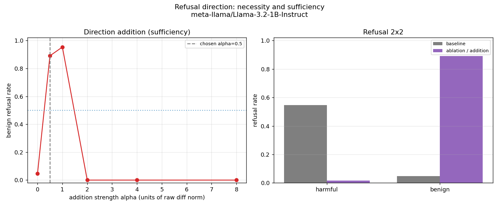
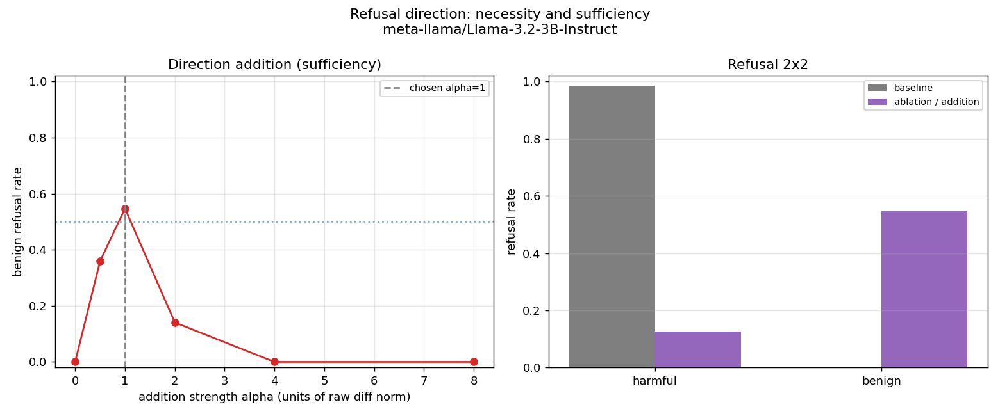
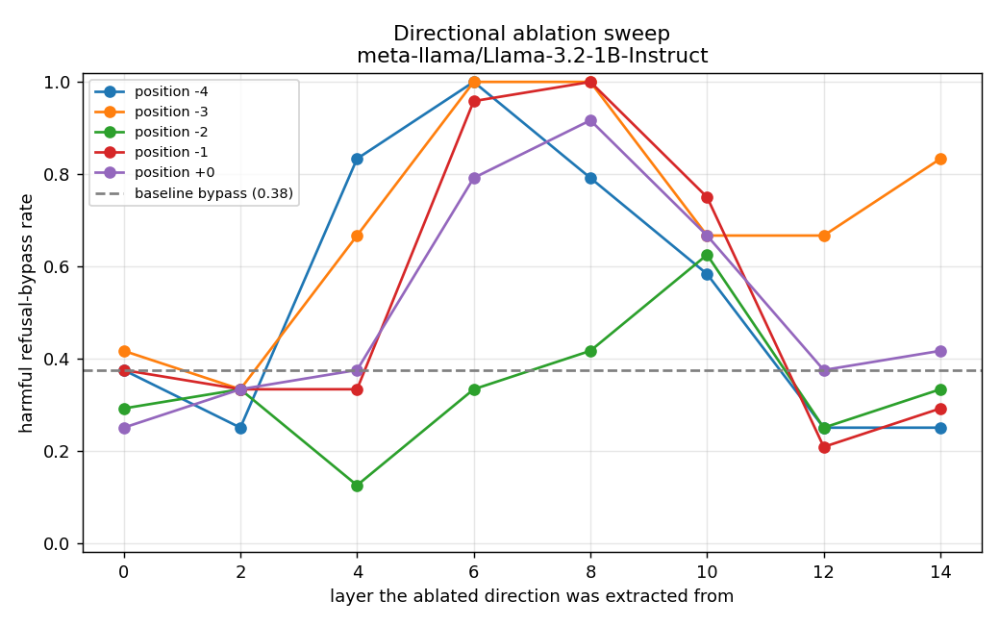
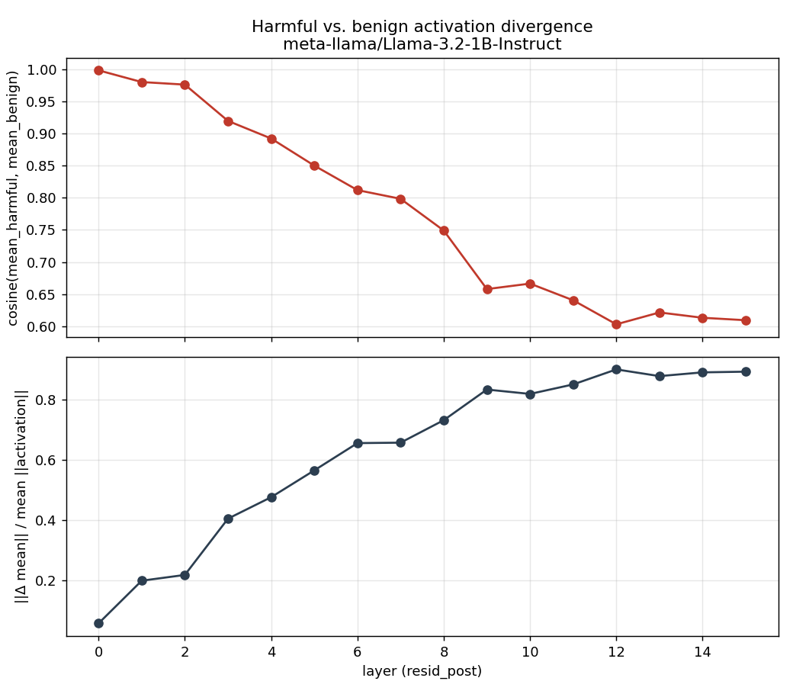

# refusal-direction-extended

This project seeks to reproduce the findings of Arditi et al.'s
"[Refusal in Language Models Is Mediated by a Single Direction][arditi]". It
also extends those findings by comparing refusal directions across Llama 3.2
Instruct model sizes and testing whether an alignment-based transfer works
between them.

[arditi]: https://arxiv.org/abs/2406.11717

## Models

The primary experiment uses:

- `meta-llama/Llama-3.2-1B-Instruct`
- `meta-llama/Llama-3.2-3B-Instruct`

We use the Instruct variants for the primary experiments. Refusal behavior is
a chat/instruction-tuning behavior, so Instruct models are the right default
for reproducing harmful-vs-benign refusal activations.

## Pipeline outputs

The reproduction runs in stages, each producing artifacts the next stage reads:

1. `prepare-datasets` → `data/refusal_datasets/` (length-matched harmful/benign
   prompts formatted with the model chat template).
2. `collect-activations` → `data/activations/<model>/resid_post.pt`
   (residual-stream activations at the last several post-instruction token
   positions for every layer, shape
   `[n_prompts, n_positions, n_layers, d_model]`) plus
   `artifacts/activations/<model>/divergence_summary.json` and `divergence.png`
   (per-layer cosine similarity between mean harmful and mean benign activations
   at the final token, a sanity check that the two classes separate in the
   deeper layers, which is where refusal is expected to be mediated).
3. `extract-directions` → `data/activations/<model>/directions.pt` (a
   normalized difference-in-means candidate refusal direction for every
   `(position, layer)` pair, computed on a train split) plus
   `artifacts/activations/<model>/directions_summary.json`.
4. `evaluate-ablation` → `artifacts/activations/<model>/ablation_*.json`
   (refusal bypass rates from projecting each candidate direction out of the
   residual stream, ranked to pick the most causally effective layer/position,
   with example completions).

## Runtime expectation

GPU-dependent tasks assume CUDA unless the task name or command explicitly
says local. You can run CUDA tasks in Colab Pro, Runpod, or another GPU
runtime. In practice:

- `mise baseline` expects CUDA in the active shell environment.
- `mise gpu-check` verifies the active environment has CUDA.
- `mise baseline-local` is the explicit opt-in for local CPU/MPS/CUDA testing.
- `mise runpod-*` tasks execute on a configured Runpod pod over SSH.

Model downloads are cached in the active runtime's Hugging Face cache. In
Colab, that usually means the runtime cache unless you configure Hugging Face
or your notebook to use mounted Drive storage. In Runpod, use persistent
storage if you want model caches to survive pod replacement.

Use `notebooks/refusal_direction_colab.ipynb` as the Colab Pro entry point. It
runs the whole pipeline end to end: GPU setup, dependency installation, model
downloads, dataset preparation, and every experiment through the cross-scale
transfer.

## Prerequisites

1. Install [`mise`](https://mise.jdx.dev/) in the environment where you run
   tasks.
2. For GPU-dependent tasks, use a Colab Pro runtime with GPU enabled.
3. Log in to Hugging Face with an account that has access to the gated Llama
   repositories.

Use `mise <task>` for project tasks. Use `mise exec -- ...` only when running
tools directly, such as `uv` or `python`.

## Common tasks

Tasks that run model code default to CUDA in the active runtime. Tasks with a
`-local` suffix are the explicit opt-in for running on CPU/MPS/CUDA locally.

```sh
# Environment and code quality
mise tasks                                # list available tasks
mise setup                                # sync Python dependencies into the active environment
mise check-env                            # print Python and core package versions
mise gpu-check                            # verify CUDA is available in the active runtime
mise lint                                 # lint Python files with Ruff
mise lint-fix                             # apply safe Ruff lint fixes
mise format                               # format Python files with Ruff
mise format-check                         # check formatting without modifying files
mise check                                # run non-download, non-GPU checks: lint + format-check

# Hugging Face and model downloads
mise hf-login                             # log in to Hugging Face for gated Llama access
mise hf-whoami                            # show the active Hugging Face account/token status
mise download-models                      # download/cache both Llama 3.2 Instruct models
mise download-model                       # alias for download-models
mise download-llama-1b                    # download/cache only Llama 3.2 1B Instruct
mise download-llama-3b                    # download/cache only Llama 3.2 3B Instruct

# Pipeline (active runtime; *-local opts into a local CPU/MPS/CUDA run)
mise prepare-datasets                     # prepare AdvBench/Alpaca datasets locally
mise smoke-datasets                       # short generation smoke test on prepared datasets
mise baseline                             # run baseline generations on CUDA in active shell
mise baseline-local                       # explicitly run baseline locally on CPU/MPS/CUDA
mise collect-activations                  # collect last-token resid_post activations on CUDA
mise collect-activations-local            # collect activations locally (CPU/MPS/CUDA)
mise smoke-activations                    # collect activations for a few prompts as a smoke test
mise extract-directions                   # difference-in-means candidate refusal directions
mise evaluate-ablation                    # validate directions by ablation on CUDA
mise evaluate-ablation-local              # validate directions by ablation locally
mise plot-ablation                        # plot the ablation sweep by layer/position (CPU)
mise evaluate-quantitative                # ablation+addition 2x2 on the test split (CUDA)
mise evaluate-quantitative-local          # ablation+addition 2x2 locally
mise plot-quantitative                    # plot the addition sweep and 2x2 table (CPU)
mise evaluate-transfer                    # cross-scale linear transfer of the direction (CUDA)
mise evaluate-transfer-local              # cross-scale linear transfer locally
mise prepare-generic                      # prepare the independent generic instruction set
mise collect-generic-activations          # collect generic-prompt activations (CUDA)
mise collect-generic-activations-local    # collect generic activations locally
mise evaluate-transfer-independent        # transfer control on independent set (CUDA)
mise evaluate-transfer-independent-local  # transfer control locally
mise all-local                            # run the whole pipeline end-to-end locally (CPU/MPS)

# Runpod (execute the corresponding step on the configured pod over SSH)
mise runpod-check-config                  # print configured Runpod connection settings
mise runpod-check-ephemeral-config        # print API-based pod spec
mise runpod-check-h100-config             # print persistent H100 pod spec
mise runpod-persistent-h100               # reuse network volume, leave H100 pod running
mise runpod-sync                          # rsync this repository to the Runpod pod
mise runpod-setup                         # install uv and sync dependencies on Runpod
mise runpod-gpu-check                     # verify CUDA on Runpod
mise runpod-download-models               # download/cache models on Runpod
mise runpod-prepare-datasets              # prepare AdvBench/Alpaca datasets on Runpod
mise runpod-smoke-datasets                # short generation smoke test on Runpod
mise runpod-baseline                      # run baseline on Runpod
mise runpod-collect-activations           # collect activations for both models on Runpod
mise runpod-smoke-activations             # collect activations for a few prompts on Runpod
mise runpod-extract-directions            # extract candidate refusal directions on Runpod
mise runpod-evaluate-ablation             # validate directions by ablation on Runpod
mise runpod-evaluate-quantitative         # ablation+addition 2x2 on Runpod
mise runpod-evaluate-transfer             # cross-scale linear transfer on Runpod
mise runpod-prepare-generic               # prepare the independent generic set on Runpod
mise runpod-collect-generic-activations   # collect generic activations (Runpod)
mise runpod-evaluate-transfer-independent # transfer control on Runpod
mise runpod-pull-artifacts                # pull generated plots/summaries from Runpod to local
mise runpod-all                           # sync, setup, download models, and run baseline
mise runpod-ephemeral                     # create pod, run baseline, terminate pod
mise runpod-terminate                     # terminate the pod (network volume preserved)
```

If `download-models`, `prepare-datasets`, or `baseline` reports an
authorization, network, or rate-limit error, run `mise hf-login` with an
account that has Llama access and rerun the task.

## Editor linting

Ruff is the project linter and formatter. Zed workspace settings in
`.zed/settings.json` enable the Ruff language server for Python linting and use
Ruff as the Python formatter. Pyright remains configured for basic type/import
analysis through `pyrightconfig.json`, with noisy lint-like type warnings
disabled so they do not duplicate Ruff.

## Colab notebook

Open `notebooks/refusal_direction_colab.ipynb` in Colab, enable a GPU runtime
(and High-RAM for the 3B model), and run the cells top to bottom. The notebook
uses `uv` directly because Colab runtimes are ephemeral and do not need the
local `mise` shell integration.

## Runpod workflow

### Persistent H100 pod + network volume

This is the preferred Runpod workflow. Runpod has been extremely overloaded of
late and requires several attempts to reserve a pod successfully. I tried
getting it working in serverless mode for a while but it was so unstable as to
be unusable. This mode creates or reuses a persistent network volume, retries
H100 pod creation until a usable SSH/CUDA pod is running, and leaves the
successful pod running for repeated experiments.

Configure your API key, Hugging Face token, and preferred Runpod datacenter:

```sh
export RUNPOD_API_KEY=...
export HF_TOKEN=hf_...
export RUNPOD_DATACENTER_ID=US-CA-2
```

Then create or reconnect to the persistent H100 pod:

```sh
mise runpod-persistent-h100
```

The task writes `.runpod.env` in the project root with the pod ID, SSH
host/port, datacenter, and network volume ID. This file is ignored by git and
is read automatically by later `mise runpod-*` tasks, so you do not need to
repeatedly export pod connection settings.

Useful optional settings:

```sh
export RUNPOD_NETWORK_VOLUME_ID=...      # reuse an existing volume
export RUNPOD_NETWORK_VOLUME_SIZE_GB=200 # default: 200
export RUNPOD_RETRY_SLEEP_SECONDS=60     # default: 60
export RUNPOD_MAX_ATTEMPTS=0             # default: 0 means retry forever
```

After the pod is ready:

```sh
mise runpod-sync
mise runpod-setup
mise runpod-download-models
mise runpod-prepare-datasets
mise runpod-baseline
mise runpod-collect-activations
mise runpod-extract-directions
mise runpod-evaluate-ablation
mise runpod-evaluate-quantitative
mise runpod-evaluate-transfer
mise runpod-prepare-generic
mise runpod-collect-generic-activations
mise runpod-evaluate-transfer-independent
mise runpod-pull-artifacts
mise runpod-terminate
```

`runpod-collect-activations` writes the large activation tensors to
`data/activations/<model>/` on the pod (kept there for the direction-extraction
step) and small summary/plot artifacts to `artifacts/activations/<model>/`. The
later stages (`extract-directions` through `evaluate-transfer-independent`) read
those cached tensors, so they reuse the collection rather than recomputing it.
`runpod-pull-artifacts` rsyncs the `artifacts/` tree back to the local repo so
the plots and summaries are available for the writeup. The activation caches are
intentionally excluded from `runpod-sync` so a later sync never deletes them
from the pod.

Failed pod creation attempts are terminated automatically. A successfully
verified H100 pod is intentionally left running so you can rerun tests
frequently; run `mise runpod-terminate` when you are done to stop GPU billing
(the network volume, and the model/activation caches on it, are preserved).

### Existing pod

```sh
export RUNPOD_SSH_TARGET=root@203.0.113.10
export RUNPOD_SSH_PORT=22
export HF_TOKEN=hf_...
mise runpod-all
```

### Ephemeral pod

```sh
export RUNPOD_API_KEY=...
export HF_TOKEN=hf_...
mise runpod-ephemeral
```

## Experimental setup

A few specifics, for anyone reproducing the numbers or judging them:

- **Models:** Llama-3.2-1B-Instruct (16 layers, width 2048) and
  Llama-3.2-3B-Instruct (28 layers, width 3072).
- **Prompts:** 256 harmful instructions from AdvBench and 256 length-matched
  benign instructions from Alpaca, each wrapped in the model's chat template.
- **Splits:** those 256 pairs are partitioned 128 / 64 / 64 into train / val /
  test. The direction is built only from the train slice, the val slice picks
  the best layer, and the test slice produces the headline numbers, so nothing
  is ever evaluated on prompts that helped define the direction.
- **The "direction":** the unit-normalized difference between the mean harmful
  and mean benign activation at a chosen (token position, layer). *Ablating* it
  means projecting it out of the residual stream at every layer; *adding* it
  means injecting a scaled copy.
- **Refusal classifier:** a blunt keyword matcher ("I can't", "I'm sorry", etc.)
  over short greedy completions. Good enough for the headline numbers, with
  caveats (see Limitations).

## Findings

I set out to reproduce the results from Arditi et al., which showed that for 
several open-weight chat models, the decision to refuse a harmful request is
governed almost entirely by a single direction in the residual-stream 
activation space: ablate the direction and the model largely stops refusing; 
add the direction to a benign prompt and it refuses even harmless requests. 
This much I was able to confirm, and I also found that scaling the direction 
further drives the model's responses into incoherence.

Another goal of my research was to answer the question: **does the refusal 
direction transfer across model sizes?** That is, if the same mechanism 
lives at the "same place" in a 1B and a 3B parameter model, that may say 
something about how stable safety-relevant features are as models grow. Though 
initial results hinted at a possible strong transfer across the two model 
sizes, refitting the linear map on a fully independent distribution of neutral 
format-matched instructions indicated this apparent transfer was spurious.

I also observed that the layer where harmful and benign representations most 
diverge sits several layers later (markedly so in the 3B) than the one whose 
ablation most blunts refusal, possibly indicating that representational 
salience and causal effect peak at different depths. It is interesting to note 
that the causal site sits at a similar, early relative depth in both models 
(~0.38 in the 1B, ~0.29 in the 3B).

## Results

All figures below are refusal rates on the held-out test split, produced by this
pipeline and saved under `artifacts/`. (These come from the local CPU/MPS run;
exact values shift a little across hardware, but the story doesn't.)

### The 2×2: necessary and sufficient

|                     | harmful prompts    | benign prompts          |
| ------------------- | ------------------ | ----------------------- |
| **1B** baseline     | 0.55               | 0.05                    |
| **1B** intervention | **0.02** (ablated) | **0.89** (added, α≈0.5) |
| **3B** baseline     | 0.98               | 0.00                    |
| **3B** intervention | **0.12** (ablated) | **0.55** (added, α≈1)   |

Erasing the single direction collapses harmful refusal (it's *necessary*), and
adding it makes the models refuse harmless requests (it's *sufficient*). That's
the core Arditi result, reproduced on a newer model family.




### Over-steering: refusal isn't a simple dial

Sweeping the addition strength α (in units of the natural difference-in-means
norm), benign refusal climbs and then falls apart:

| α (×natural)      | 0.5  | 1    | 2    | 4    |
| ----------------- | ---- | ---- | ---- | ---- |
| 1B benign refusal | 0.89 | 0.95 | 0.00 | 0.00 |
| 3B benign refusal | 0.36 | 0.55 | 0.14 | 0.00 |

Past roughly the natural scale, the residual stream is corrupted and the output
degrades into repetitive gibberish (visible via `inspect_addition`), which the
keyword classifier, correctly, does not count as a refusal.

### Separation peaks later than causation

Harmful and benign activations are *most distinguishable* deep in the network
(the cosine between the class means bottoms out around layer 12 of 16 in the 1B
and layer 23 of 28 in the 3B), yet the direction that *causally* controls 
refusal sits much earlier: layer 6 (1B) and layer 8 (3B), both around 30% 
relative depth. Where the model best *represents* the harmful/benign difference 
is not where it most *acts* on it.




### Transfer: 'real' until you control for it

Fit a linear map from the 1B activation space into the 3B's, push the 1B refusal
direction through it, and ablate the result in the 3B (lower harmful refusal
means the transferred direction "worked"; a random direction is the control):

| map fit on              | cos vs native 3B | 3B refusal when ablated |
| ----------------------- | ---------------- | ----------------------- |
| `val` (same dist)       | 0.99             | **0.08** (native 0.12)  |
| `generic` (independent) | **0.48**         | **0.91** (random 0.97)  |

(3B baseline 0.98; native 3B direction 0.12; random control 0.97.) Fit the map
on data drawn from the same harmful/benign distribution and the transfer looks
excellent. Fit it on a genuinely independent set of neutral instructions and it
collapses. The apparent transfer was an artifact of the fitting data, not a
real cross-scale alignment.

## Detailed log of implementation

Rather than use the authors' source code repository, I wanted to reproduce the 
results from scratch, so as to help me understand the underlying operations 
better and ensure I was not skipping any steps.

On the first day of working on this, I began using Colab Pro, but after 
noticing that every change to the notebook often resulted in a lot of wasted 
time in prerequisite steps, I decided to switch to RunPod.io to try to script a 
more automated solution that didn't require clicking on each step in the 
notebook. Despite abandoning the notebook-based approach early on, I backfilled 
the notebook with all the implemented tasks, so this mode of operation is still 
supported.

RunPod.io also proved difficult. Their service was quite oversubscribed and 
requests for dedicated instances often failed for several minutes before 
succeeding. I thought maybe I would have better luck with RunPod's serverless
architecture, so I spent a few hours working on a docker container for that, 
only to learn that requests for serverless execution were just as unreliable. I 
was about to give up on RunPod altogether, but since I already had prior credit 
on RunPod, I gave it one more try, eventually managing to reserve an instance 
and implementing the rest of the project while the instance was running.

Although I have over 20 years of full-stack programming experience (several 
years of it in Python), I'm not especially familiar with PyTorch and machine 
learning algorithms, so I relied on Claude Code for help. Nevertheless, I was 
keen on keeping the source code modular and easy-to-follow, dividing up the 
functionality into six categories (activations, data, interventions, plots, 
runtime, and transfer) and keeping the amount of code in each file relatively 
short. I also focused on project hygiene with mise and uv for dependency 
management, and ruff for formatting and linting.

The second and third days were spent getting a working implementation. Each 
stage of the workflow is a separate mise task, and the tasks build on each 
other:

1.  **prepare_datasets**: pulls in datasets of harmful and benign instructions 
    for testing model responses and formats them for how Llama expects.
2.  **smoke_datasets**: quick sanity check: loads the 1B model and generates 
    short completions for a couple of prompts, making sure the dataset, 
    tokenizer formatting, model loading and generation path are working before 
    moving forward.
3.  **baseline**: loads each model and generates completions for one hard-coded 
    harmful and one benign prompt, confirming that the unaltered models work as 
    expected.
4.  **collect_activations**: Runs every prompt through each model with forward 
    hooks, capturing the residual stream at the last few instruction tokens 
    across all layers. Saves the [prompts, positions, layers, d_model] tensor, 
    plus a per-layer harmful-vs-benign divergence summary and plot.
5.  **extract_directions**: Computes the unit-normalized difference-in-means   
    refusal direction for every (position, layer) pair. This is done with only 
    the training slice of the prompts, so that the changed models can be tested 
    later on held-out prompts.
6.  **evaluate_ablation**: Sweeps candidate directions, selecting the
    position/layer whose direction, when ablated, maximizes the refusal-bypass 
    rate on the held-out harmful prompts.
7.  **plot_ablation**: Plots the bypass rate versus the layer each direction 
    was extracted from. Helps to visualize that the causally effective layer is 
    earlier than the layer of maximum representational separation.
8.  **evaluate_quantitative**: Calculates the main results. On the held-out 
    test split, measures harmful refusal baseline-vs-ablated and benign refusal 
    baseline-vs-added.
9.  **plot_quantitative**: Plots the main results.
10. **inspect_addition**: Prints the raw benign completions at several addition 
    strengths so the over-steering is readable. Saves the completions for
    the writeup.
11. **evaluate_transfer**: Fits a linear map between the 1B and 3B activation 
    spaces (2048→3072), pushes the 1B refusal direction through it, and tests 
    whether it ablates refusal in the 3B as well as the native direction.
12. **prepare_generic**: Builds an independent, format-matched neutral 
    instruction set (Dolly-15k, context-free), formatted with the same chat 
    template. This distribution shares nothing with the harmful/benign prompts
    and is used to refit the transfer map as a control against circularity.
13. **collect_generic_activations**: Runs the generic prompts through both 
    models and saves their residual activations. This is the independent 
    fitting data for the transfer control: a different prompt distribution from 
    the harmful/benign prompts that define the refusal direction so that we can
    test if the transfer survives from 1B to 3B.
14. **evaluate_transfer_independent**: Refits the alignment map on the 
    independent generic activations and re-runs the transfer test. It ends up
    demonstrating that the earlier positive result was an artifact of fitting 
    on refusal-relevant data.

## Surprises along the way

1. **Over-steering causes the model to break down**: Push the steering 
   coefficient past ~2× natural scale and the model becomes incoherent.
2. **Separation ≠ causation**: The most linearly separable layer is not the 
   most causally effective one.
3. **The transfer reversal**: The control ended up negating what initially 
   looked like a positive result. The honest answer ("doesn't transfer") is 
   more accurate than the tempting one.

## Limitations

A few caveats worth keeping in mind:

- **The refusal detector is crude.** It just checks whether a reply starts with
  phrases like "I can't" or "I'm sorry." That's fine for clear cases, but it
  can't tell a genuine refusal apart from broken or repetitive text, so I trust
  the main before/after numbers more than the fine detail of the over-steering
  sweep.
- **The 1B barely refuses to begin with.** Unaltered, it refuses only about 55%
  of harmful prompts (the 3B refuses ~98%), so its numbers are noisier and I'd
  lean on the 3B for the stronger claims.
- **Ablation doesn't remove refusal completely.** A little refusal is always
  left over, so "a single direction" is a good approximation rather than a hard
  rule.
- **The transfer test is small.** I fit the map on a limited amount of data with
  a simple linear method, so I'd treat the "doesn't transfer" result as
  suggestive rather than settled.
- **It's a small study.** Two models from one family and one harmful/benign
  dataset. I haven't tested whether any of this holds more broadly, or whether
  it survives fine-tuning.

## Why this matters for safety

If refusal in a model depends on roughly one direction at one early-middle 
layer, that's pretty fragile protection: it's exactly the structure that 
adversarial suffixes and fine-tuning attacks exploit, and the fact that someone 
could remove it with a single rank-1 edit underlines how shallow a lot of 
current behavioral safety training is.
